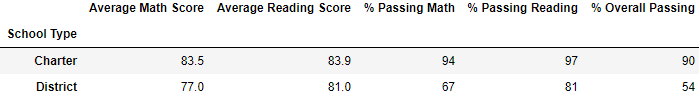

# School_District_Analysis
# Analysis of School District Data
> Python script written & managed in Jupyter Notebook using PANDAS and Numpy libraries used to read, analyze, and output school, student, and district data. 

## Overview of School District Analysis
> Analysis conducted to create visualization of district-wide metrics. Evidence of scholastic dishonesty necessitated repeat analysis after data modification and comparison of the two data sets. 

### Results
> District Summary

    - Slight decrease in average math score (.1)
    - No change in average reading score
    - Slight decrease in % passing math (.2)
    - Slight decrease in % passing reading (.3)
    - Slight decrease in overall passing (.1)

> School Summary

    - Slight decrease in average math score (.067)
    - Slight increase in average reading score (.047)
    - Slight decrease in % passing math (.086)
    - Slight decrease in % passing reading (.29)
    - Slight decrease in % overall passing (.318)

> School Performance Ranking

    - Thomas High School is ranked second for % overall passing both before and after removing the 9th grade students. 

> Math & Reading Scores by Grade

    - Since these data frames were already grouped by grade level, the only difference is the removal of the Thomas High School 9th grader scores which is replaced with 'nan'.

> Scores by School Spending

    - There is no change to the scores based on per student spending.

> Scores by School Size

    - There is no change to the scores based on size of school.

> Scores by School Type

    - There is no change to the scores based on type of school. 

## Summary
> After analysis of the metrics related to student grades from before and after the removal of the 9th grade students the following noteworthy differences have been identified:
    - A decrease in the overall passing rate of Thomas High School students by .3%.
    - A decrease in the reading scores passing rate of .29% at Thomas High School and .3% for the entire district. 
    - A decrease in the math scores passing rate of .2% for the district. 
    - An increase in the average reading score for Thomas High School students of .047. 